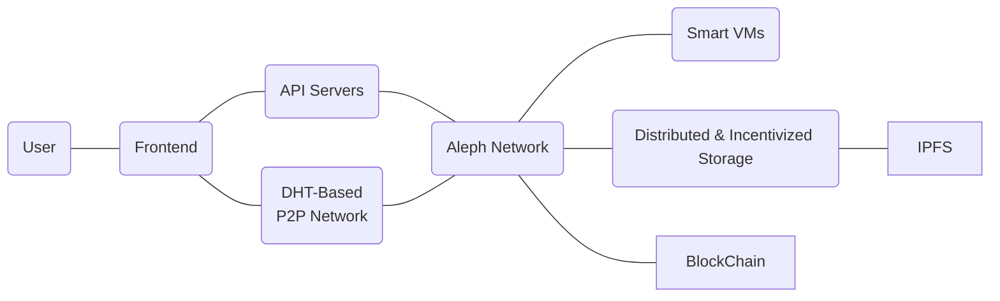
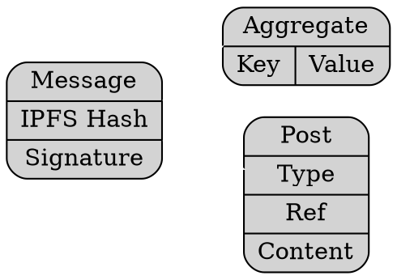
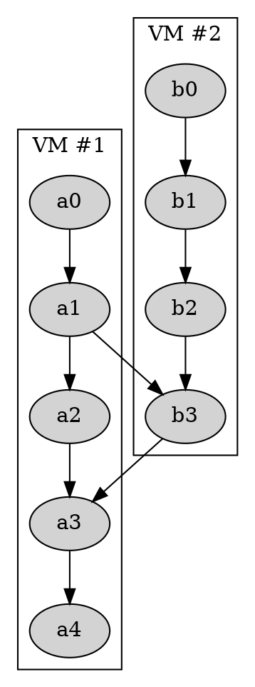

Aleph is an universal layer-2 platform

# Why ?

##

- Delays
- Costs
- Onboarding
- Storage

## How ?

- Off-chain state
- Free actions
- IPFS incentive
- Cross-chain

# Network

## 

##

- Replicated data
- All the data isn't everywhere
- Per dApp "subnetwork"

## Current state

- Proof of Concept testnet
- Storage
- Posts
- Aggregates
- No VMs (yet)
- Only NULS (so far)

## Use cases

- Data Store
- Social networks
  - Medium
  - Instagram
  - Chat
- IoT storage

## Future use cases

- Games
- Currencies/Tokens
- Business Applications
- ...

##

## VMs / Smart Contracts

- State object link
  - ref. previos hash
  - link as a DAG

##

 
# Example application

## Repositories

[https://github.com/aleph-im/aleph-blogs](https://github.com/aleph-im/aleph-blogs)
[https://github.com/aleph-im/simple-dapp](https://github.com/aleph-im/simple-dapp)

# Thanks

##

Project [Aleph.im](https://aleph.im)

Moshe Malawach

